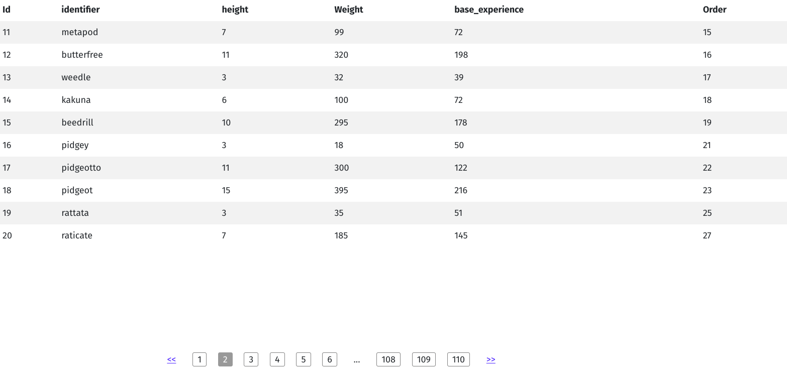
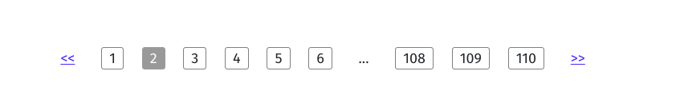

 # :book:React pagination with paginated data from knex  :star: :boom: 

When digging the internet on how to render paginated data from back end my team face a lack of information disregard the topic. So this was our team's solution to exhibit knex backend paginated data in a reasonable way.

## :star:Prerequisites

1. paginated data served from backend
2. reactstrap v.8.10.0
3. styled components v.5.3.1
4. Reactjs v.17.0.2
5. yarn (because we prefer it, but you can use npm as well)
6. git
7. postgres

## :star:Setup backend

Initiate the node project and create folders and files.

```cmd
yarn init -y

yarn add express dotenv cors knex pg knex-paginate

yarn add nodemon -D

touch knexfile.js

touch server.js

mkdir backend

cd backend

mkdir src

cd src

touch app.js

git clone https://github.com/ninjarobot/pokedata.git vendor

cd vendor

make

```
(make sure the logged system user exists in postgres)

knexfile.js

```js
import Knex from "knex";
import { config } from "dotenv";
import pg from "pg";
config();

pg.defaults.ssl = true;

const knexConfig = {
  development: {
    client: "pg",
    connection: {
      host: process.env.DB_HOSTNAME || "127.0.0.1",
      database: process.env.DB || "pokedata",
      user: process.env.DB_USER || "jimmyginga",
      password: process.env.DB_PASSWORD || "root",
      port: process.env.DB_PORT || "5432",
      ssl: { rejectUnauthorized: false },
    },
    pool: {
      min: 2,
      max: 10,
    },
    migrations: {
      tableName: "knex_migrations",
      directory: "./src/database/migrations",
    },
  },
  //uncomment for production
  /*production: {
    client: 'pg',
    connection: {
      host: process.env.DB_HOSTNAME,
      database: process.env.DB,
      user: process.env.DB_USER,
      password: process.env.DB_PASSWORD,
      port: process.env.DB_PORT,
      ssl: { rejectUnauthorized: false }, // install ssl lib and delete line
    },
    pool: {
      min: 2,
      max: 10,
    },
    migrations: {
      tableName: 'knex_migrations',
      directory: './src/database/migrations',
    },
  },*/
};

export default Knex(knexConfig.development);
```

server.js

```js
import { app } from "./src/app.js";
import { createServer } from "http";
const PORT = 8008;
const server = createServer(app);

server.listen(PORT, () => console.log(`Server is running on ${PORT} port`));
```

## :star:How to send paginated data with knex

See below an example of controller using node, express and knex

### :boom:Controller file

app.js

```js
import express from "express";
import cors from 'cors'
import knex from "../knexfile.js";
import { attachPaginate } from 'knex-paginate'

const app = express();
app.use(cors())
attachPaginate()

app.get("/pokemon", async (req, res) => {
  try {
    const { page } = req.query
    console.log(page);
    const pokemon = await knex("pokemon").select().paginate({currentPage: page, isLengthAware: true,});
    res.status(200).json(pokemon);
  } catch (error) {
    return res.status(400).json({ message: `Can't list pokemons: ${error}` });
  }
});

export { app };
```

Then run <b>``` yarn run serve:dev```</b> in the terminal, the <b>Server is running on 8008 port </b> log will appear, it means that you can make requests in you <i>http://localhost:8008/</i>

### :dart: Endpoints
| path        | Method   |Result                   |
| ------------|----------|-------------------------|
| /pokemon    | GET      |Array of pokemon objects |

## :telescope: Setup frontend

```cmd
npx create-react-app frontend -y

yarn add axios styled-components react-paginate reactstrap bootstrap

cd frontend/src

rm App.css App.test.js index.css logo.svg reportWebVitals.js setupTests.js

touch api.js styles.js
```

api.js
```js
import axios from "axios";
import dotenv from "dotenv";
dotenv.config();

let baseURL;

if (process.env.NODE_ENV === "production") {
  baseURL = process.env.REACT_APP_API_URL;
} else {
  baseURL = "http://localhost:8008";
}

export const api = axios.create({
  baseURL,
  validateStatus: () => {
    return true;
  },
});
```

App.js
```js
import React from "react";
import { api } from "./api";
import { Table } from "reactstrap";
import 'bootstrap/dist/css/bootstrap.min.css'
import { Container, MyPaginate } from "./styles";

function App() {
  const [pokemons, setPokemons] = React.useState([]);
  const [currentPage, setCurrentPage] = React.useState(1);
  const [totalPages, setTotalPages] = React.useState();

  
  const getPokemons = async (page) => {
    await api.get(`/pokemon?page=${page}`).then((result) => {
      if (result.status !== 200) return alert("Something went wrong!");
      setTotalPages(result.data.pagination.lastPage)
      return setPokemons(result.data.data);
    });
  };

   const handleClick = (page) => {
    //need to increment one in the current page becouse knex pagination start to 0
    return setCurrentPage(page + 1)
  }
    
  React.useEffect(() => {
    getPokemons(currentPage);
    return () => {};
  }, [currentPage]);

  return (
    <>
      <div className="body">
        <div className="div-table pb-5">
          <Table striped borderless hover responsive className="mb-5">
            <thead>
              <tr>
                <th scope="row">Id</th>
                <th scope="row">identifier</th>
                <th scope="row">height</th>
                <th scope="row">Weight</th>
                <th scope="row">base_experience</th>
                <th scope="row">Order</th>
              </tr>
            </thead>
            <tbody>
              {pokemons.length === 0 ? (
                <tr className="ml-auto mr-auto">
                  <td>No pokemon</td>
                </tr>
              ) : (
                pokemons.map((pokemon) => {
                  return (
                    <tr key={pokemon.id}>
                      <td>{pokemon.id}</td>
                      <td>{pokemon.identifier}</td>
                      <td>{pokemon.height}</td>
                      <td>{pokemon.weight}</td>
                      <td>{pokemon.base_experience}</td>
                      <td>{pokemon.order}</td>
                    </tr>
                  );
                })
              )}
            </tbody>
          </Table>
        </div>
         <Container>
          <MyPaginate
            className="noselect"
            breakLabel="..."
            nextLabel={">>"}
            pageRangeDisplayed={5}
            onPageChange={(e) => handleClick(e.selected)}
            pageCount={Number(totalPages)}
            previousLabel={"<<"}
          />
        </Container> 
      </div>
    </>
  );
}

export default App;
```

#:computer:Final result



<hr/>


**Note**: we not applied a hard styles, feels free to contribute with this and others features :wink:.